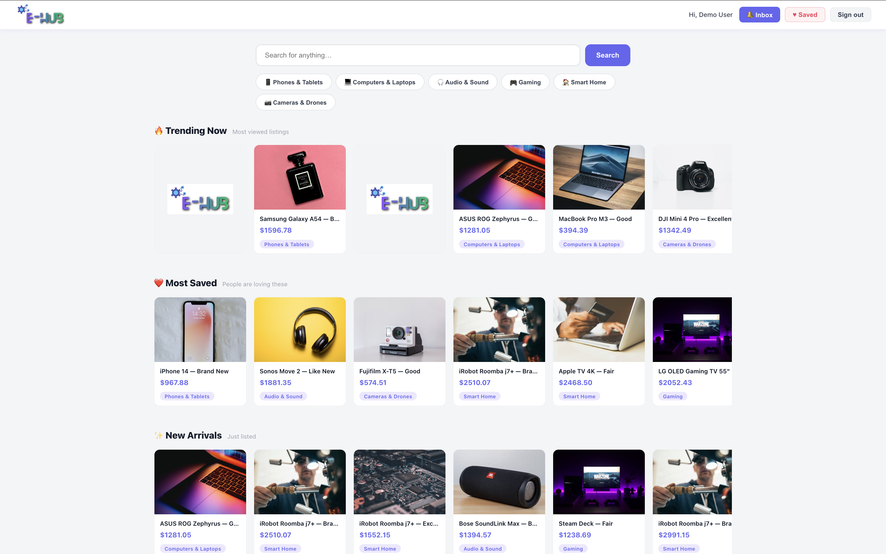
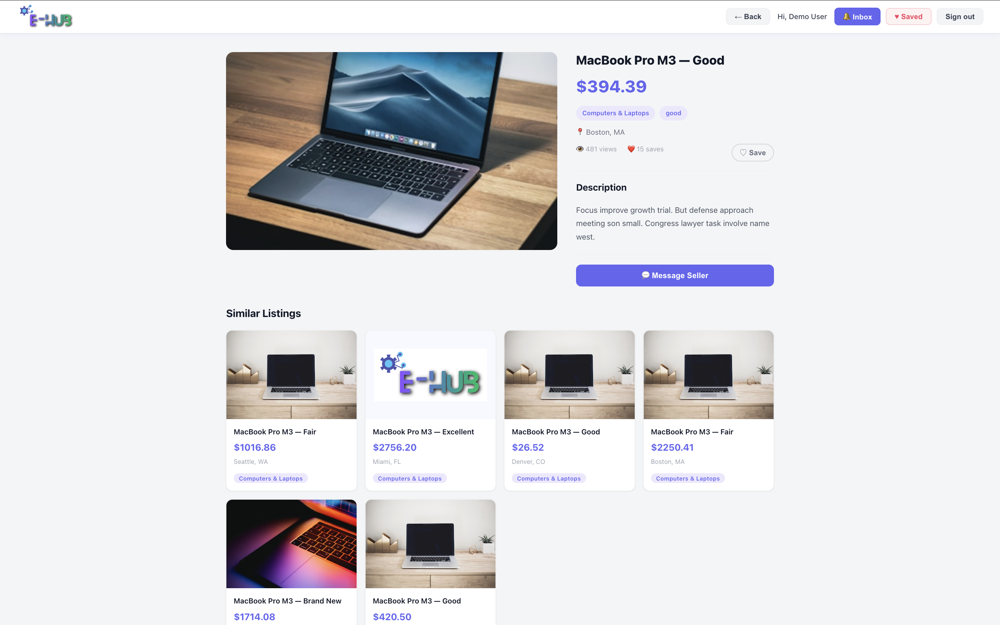
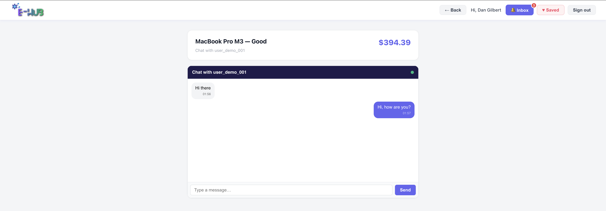
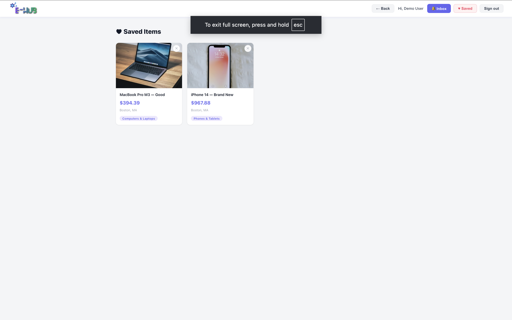
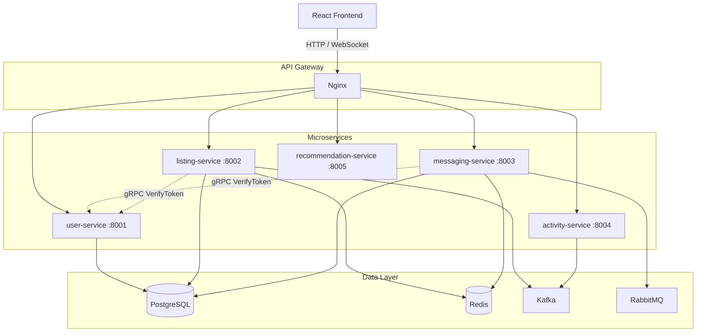
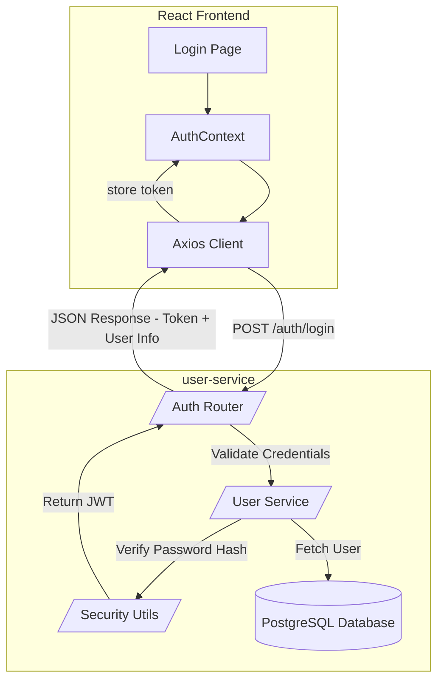
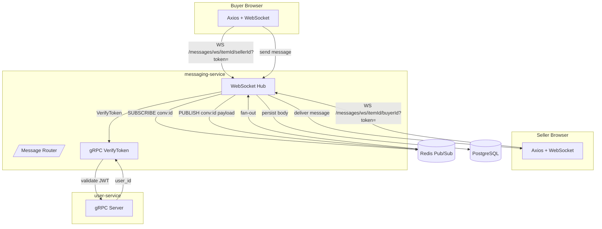
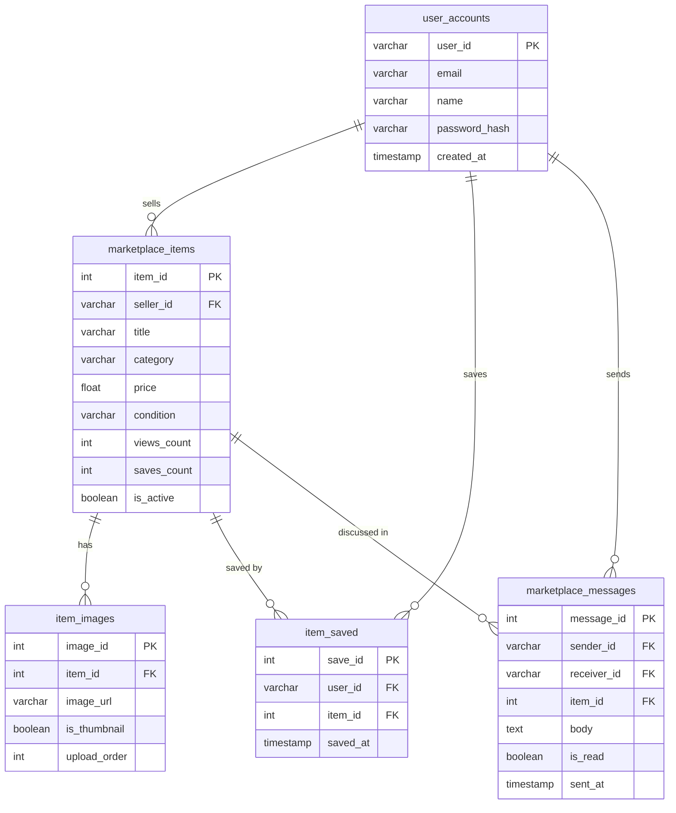

<div align="center">
  

  <h1>ElectroHub</h1>
  <p>A full-stack electronics marketplace built on microservices — buy, sell, chat, and discover products in real time.</p>

  <p>
    
    
    
    
    
    
  </p>
</div>


## Where to Start

| I want to… | Go here |
|||
| Run the project locally | [Getting Started](#getting-started) in this file |
| Understand how services connect | [Architecture Diagram](#architecture-diagram) in this file |
| See all API endpoints | [API Reference](#api-reference) in this file |
| Debug a broken container or service | [`DEPLOYMENT.md`](DEPLOYMENT.md) → Troubleshooting |
| Deploy to a server / production notes | [`DEPLOYMENT.md`](DEPLOYMENT.md) → Production Readiness |
| Change environment variables or secrets | [`DEPLOYMENT.md`](DEPLOYMENT.md) → Environment Variables |
| Understand the database schema | [Data Model](#data-model) in this file |


## What it is

ElectroHub is a peer-to-peer marketplace for electronics. Users list items, buyers browse and filter by category, message sellers directly, save items to a wishlist, and get AI-powered recommendations based on what they're viewing.

Everything runs locally in Docker — one `docker compose up` brings up the full stack.


## Features

- **Browse & Search** — filter by category (Phones, Laptops, Gaming, Audio, Smart Home, Cameras), keyword search, trending / most-saved / new-arrivals sections
- **Real-time Chat** — WebSocket messaging between buyers and sellers, per-conversation threads
- **Wishlist** — save items with a heart button; backed by Redis for instant reads with PostgreSQL persistence
- **AI Recommendations** — SBERT (`all-MiniLM-L6-v2`) semantic similarity; "Similar Listings" shown on every item page
- **Notification Bell** — live unread message count in the navbar, polls every 30 seconds
- **JWT Auth** — token stored in localStorage, injected into every API call via Axios interceptor


## Screenshots

<table>
  <tr>
    <td width="55%">
      
    </td>
    <td width="45%" valign="middle" style="padding-left:24px">
      <h3>Browse & Discover</h3>
      <p>
        The home page surfaces three personalised rows — <strong>Trending Now</strong> (most viewed),
        <strong>Most Saved</strong>, and <strong>New Arrivals</strong> — pulled from a live pool of
        listings. Category pills and a search bar let buyers drill down instantly.
        Navigation between pages is instant thanks to a 5-minute client-side cache.
      </p>
    </td>
  </tr>

  <tr>
    <td width="45%" valign="middle" style="padding-right:24px">
      <h3>Item Detail & AI Recommendations</h3>
      <p>
        Every listing shows full images, condition, location, and live save count.
        Buyers can message the seller directly or save the item to their wishlist with one click.
        Below the listing, <strong>Similar Listings</strong> are generated in real time using
        SBERT semantic embeddings — not just category matching.
      </p>
    </td>
    <td width="55%">
      
    </td>
  </tr>

  <tr>
    <td width="55%">
      
    </td>
    <td width="45%" valign="middle" style="padding-left:24px">
      <h3>Real-time Inbox & Chat</h3>
      <p>
        Messages are grouped into conversation threads per listing.
        The notification bell in the navbar shows a live unread count.
        Under the hood, each chat session is a WebSocket connection backed by
        Redis Pub/Sub — so both buyer and seller receive messages instantly
        without polling.
      </p>
    </td>
  </tr>

  <tr>
    <td width="45%" valign="middle" style="padding-right:24px">
      <h3>Wishlist</h3>
      <p>
        Saved items are stored in a Redis <code>SET</code> per user for O(1) reads,
        with every save also written to Postgres for durability.
        The wishlist page shows all saved listings in a grid with a one-click
        remove button. If Redis restarts, the cache is automatically rebuilt
        from the database on the next request.
      </p>
    </td>
    <td width="55%">
      
    </td>
  </tr>
</table>


## Architecture Diagram




## Login Flow




## Real-time Chat Flow




## System Components

| Component | Tech | Role |
||||
| `user-service` | FastAPI · bcrypt · PyJWT | Registration, login, JWT issue & verification via gRPC |
| `listing-service` | FastAPI · SQLAlchemy · Redis | Item CRUD, browse/search, wishlist (Redis SET + Postgres) |
| `messaging-service` | FastAPI · WebSocket · Redis Pub/Sub | Real-time chat, inbox, unread count |
| `activity-service` | FastAPI · Kafka consumer | Tracks views, searches, interactions |
| `recommendation-service` | FastAPI · SBERT · NumPy | Semantic similarity over item embeddings |
| `nginx` | Nginx 1.25 | API gateway, rate limiting, WebSocket proxy |
| `postgres_shard0` | PostgreSQL 15 | Primary data store (users, items, messages, saved) |
| `redis` | Redis 7 | Wishlist sets, chat pub/sub, caching |
| `kafka` | Apache Kafka 3.7 (KRaft) | Item view event streaming |
| `rabbitmq` | RabbitMQ 3 | Async notification delivery |


## Data Model




## Getting Started

### Prerequisites

- Docker Desktop 4.x with Compose v2
- 8 GB RAM recommended (SBERT loads a ~90 MB model on startup)
- macOS, Linux, or WSL2

### Run

```bash
git clone https://github.com/your-username/electrohub.git
cd electrohub
docker compose up --build
```

First build takes ~5 minutes — PyTorch and sentence-transformers layers are large. Subsequent starts use the Docker layer cache and are much faster.

| Service | URL |
|||
| Frontend | http://localhost:3000 |
| API Gateway | http://localhost:80 |
| user-service | http://localhost:8001 |
| listing-service | http://localhost:8002 |
| messaging-service | http://localhost:8003 |

### Seed the database

Once all containers are healthy, populate 500 electronics listings:

```bash
docker exec -it electrohub-backend python seed_all.py
```

Creates 100 users · 500 items across 6 categories · 995 product images · 3,000 interactions · 200 sample messages.

## Project Structure

```
electrohub/
├── docker-compose.yml
├── nginx/
│   └── nginx.conf                  # API gateway, rate limits, WS proxy
├── protos/
│   ├── user.proto                  # gRPC: VerifyToken, GetUser
│   ├── listing.proto               # gRPC: GetItem
│   └── notification.proto
├── database/
│   ├── 01_schema.sql
│   └── 02_indexes.sql
├── services/
│   ├── shared/                     # structlog config shared across all services
│   ├── user-service/
│   ├── listing-service/
│   ├── messaging-service/
│   ├── activity-service/
│   ├── notification-service/
│   └── recommendation-service/     # SBERT inference service
├── frontend/
│   └── src/
│       ├── pages/                  # Home, ItemDetail, Inbox, Thread, Saved, Login
│       ├── components/             # Navbar (unread badge, wishlist link)
│       ├── context/AuthContext.jsx
│       └── services/api.js         # Axios with token injection
└── backend/
    └── seed_all.py
```


## API Reference

### Auth

| Method | Path | Description |
||||
| POST | `/auth/register` | Create account |
| POST | `/auth/login` | Returns JWT + user object |

### Marketplace

| Method | Path | Description |
||||
| GET | `/marketplace/items` | List / search items (`search`, `category`, `limit`, `skip`) |
| GET | `/marketplace/items/{id}` | Item detail — also increments view count |
| GET | `/marketplace/items/{id}/saved` | Check if item is in current user's wishlist |
| POST | `/marketplace/items/{id}/save` | Add to wishlist |
| DELETE | `/marketplace/items/{id}/save` | Remove from wishlist |
| GET | `/marketplace/users/me/saved` | All saved items for current user |
| GET | `/marketplace/categories` | Category listing counts |

### Messaging

| Method | Path | Description |
||||
| POST | `/messages/send` | Send a message |
| GET | `/messages/inbox` | All received messages |
| GET | `/messages/unread-count` | Badge count (unread messages) |
| WS | `/messages/ws/{item_id}/{other_user_id}?token=` | Real-time chat |

### Recommendations

| Method | Path | Description |
||||
| GET | `/recommendations/{item_id}?limit=6` | Top-N similar items via SBERT |


## How SBERT Recommendations Work

On startup, `recommendation-service` loads every active item and builds a text string per item:

```
"{title}. {category}. {condition}. {description}"
```

Each string is encoded with `all-MiniLM-L6-v2` (384-dimensional embeddings, L2-normalised). When a user opens an item page, the service runs a dot product between that item's vector and the full embedding matrix — equivalent to cosine similarity in O(n) — and returns the top results, skipping the item itself.

The model is downloaded and baked into the Docker image at build time, so there are no cold-start downloads in production.


## Wishlist & Redis

The wishlist uses a Redis `SET` per user (`wishlist:{user_id}`):

| Operation | Redis command | Complexity |
||||
| Save item | `SADD wishlist:{uid} {item_id}` | O(1) |
| Unsave item | `SREM wishlist:{uid} {item_id}` | O(1) |
| Check if saved | `SISMEMBER wishlist:{uid} {item_id}` | O(1) |
| Load all saved | `SMEMBERS wishlist:{uid}` | O(n) |

Every save/unsave is also written to the `item_saved` Postgres table. On cache miss (e.g. after a Redis restart), the service reads from Postgres and re-warms the Redis SET automatically.


## Capacity & Rate Limits

This section documents what the system can actually handle, derived directly from the current configuration — not estimates.

### Per-user Rate Limits (Nginx)

Limits are enforced **per IP address** by Nginx using token bucket zones defined in [`nginx/nginx.conf`](nginx/nginx.conf):

| Zone | Steady rate | Burst allowance | Applies to |
|||||
| `api_login` | 5 req / min | +2 immediate | `/auth/*` |
| `api_browse` | 60 req / min | +20 immediate | `/marketplace/*` |
| `api_general` | 30 req / min | +10 immediate | `/messages/*`, `/activity/*`, all others |

**What this means in practice:** A single user can open the home page, scroll through listings, click into items, and save to wishlist comfortably within the browse limit (60 req/min = 1 request/second). The login zone is intentionally tight — 5 attempts per minute — as brute-force protection.

Exceeding a limit returns HTTP `429 Too Many Requests`. Each zone has 10 MB of shared memory, enough to track ~78,000 unique IPs simultaneously before eviction.


### Database Connection Capacity

PostgreSQL is running with its default `max_connections = 100` (confirmed on the live container). Each service holds a SQLAlchemy connection pool:

| Service | `pool_size` | `max_overflow` | Max DB connections |
|||||
| `user-service` | 5 | 10 | **15** |
| `listing-service` | 5 | 10 | **15** |
| `messaging-service` | 5 | 10 | **15** (SQLAlchemy default) |
| `activity-service` | 3 | — | **3** |
| **Total** | | | **48** |

With 48 connections consumed by services and PostgreSQL reserving 3 for superuser access, there are **~49 connections of headroom** before hitting the `max_connections` ceiling. The database is **not** the bottleneck in this setup.

> Source: `services/*/app/core/database.py` and `docker exec electrohub-postgres-shard0 psql -c "SHOW max_connections;"`


### Concurrency Limits

| Layer | Hard limit | Evidence |
||||
| Nginx simultaneous connections | **1,024** | `worker_connections 1024` in `nginx.conf` line 1 |
| Concurrent WebSocket sessions | **~300** | Shares the 1,024 connection budget with HTTP; each WS is a persistent connection |
| Concurrent DB queries (listing) | **15** | `pool_size=5, max_overflow=10` in `listing-service/app/core/database.py` |
| Concurrent DB queries (all services) | **48** | Sum of all pool maxima above |
| PostgreSQL hard ceiling | **100** | `SHOW max_connections` on live container |


### Realistic Concurrent User Estimate

All five services run as **single-process Uvicorn** (no `--workers` flag in any Dockerfile CMD). FastAPI is async, so I/O-bound work (DB queries, Redis calls) runs concurrently within one process. CPU-bound work serialises.

| Workload type | Estimated concurrent users | Bottleneck |
||||
| Browsing / searching | **50 – 100** | Single Uvicorn worker on listing-service; async I/O helps but CPU serialises at ~100 |
| Active WebSocket chat | **200 – 300** | Nginx connection budget (1,024 shared with HTTP traffic) |
| Recommendation queries | **10 – 20** | SBERT inference is CPU-bound; ~100–500 ms per call on CPU-only PyTorch, single process serialises |
| Login / register | **5 per IP / min** | Nginx `api_login` zone; bcrypt is intentionally slow (~200 ms), limits effective throughput |

The **recommendation service** is the first thing to saturate under load — SBERT runs on CPU, inference blocks the event loop, and there is no worker pool. Under realistic usage (not every page view hits recommendations simultaneously) this is fine for a development deployment.


### What Would Need to Change for Production Scale

| Current limitation | Production fix |
|||
| Single Uvicorn worker per service | Add `--workers 4` (or use Gunicorn + Uvicorn workers) |
| SBERT single-process CPU inference | Add worker pool or move to a GPU instance |
| `max_connections = 100` on Postgres | Raise to 200–500, or add PgBouncer as a connection pooler |
| No resource limits in `docker-compose.yml` | Add `mem_limit` and `cpus` per service to prevent one container starving others |
| Nginx single worker | Set `worker_processes auto` to use all CPU cores |


## Further Reading

- [`DEPLOYMENT.md`](DEPLOYMENT.md) — step-by-step setup, container reference, troubleshooting, and production notes
- [`database/01_schema.sql`](database/01_schema.sql) — full database schema
- [`nginx/nginx.conf`](nginx/nginx.conf) — rate limiting zones and upstream routing
- [`services/recommendation-service/app/main.py`](services/recommendation-service/app/main.py) — SBERT embedding and similarity logic
- [`backend/seed_all.py`](backend/seed_all.py) — data seed script (users, items, images, messages)


<div align="center">
## Author

**Meghna Nag**
*University of Colorado Boulder — 2025*

© 2026 Meghna Nag. All rights reserved.
</div>
