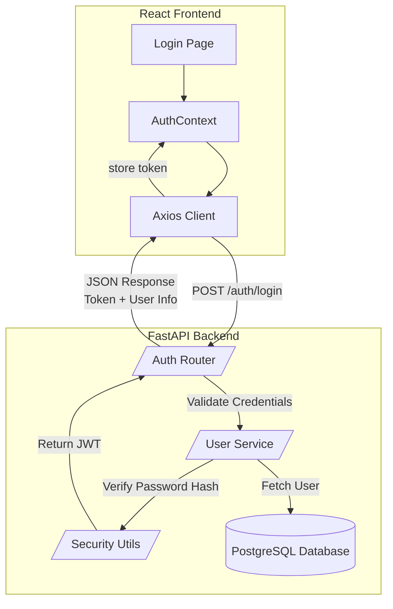

# ElectroHub Marketplace

A full-stack electronics marketplace built using **FastAPI + PostgreSQL** on the backend and **React + Axios** on the frontend. This project includes authentication (JWT), user management, product listing structure, and a clean architecture suitable for cloud deployment.

---

## Features

### **Backend (FastAPI)**

* JWT Authentication (Login)
* PostgreSQL database (SQLAlchemy models)
* Modular service-based architecture
* CORS-enabled API
* Secure password hashing (bcrypt/passlib)
* Environment-based configuration
* Seed data + schema setup scripts

### **Frontend (React)**

* Login page connected to FastAPI backend
* AuthContext for global authentication state
* Axios client with token injection
* Protected routes structure

---

## Architecture Diagram



---

## Project Structure

```
electrohub-marketplace/
│
├── backend/
│   ├── app/
│   │   ├── api/
│   │   ├── core/
│   │   ├── models/
│   │   ├── schemas/
│   │   └── services/
│   ├── requirements.txt
│   └── start_backend.sh
│
├── frontend/
│   ├── public/
│   ├── src/
│   │   ├── context/
│   │   ├── pages/
│   │   ├── services/
│   │   └── App.jsx
│   ├── package.json
│   └── README.md
│
└── database/
    ├── 01_schema.sql
    ├── 02_indexes.sql
    ├── 03_seed_data.py
    └── init_database.sh
```

---

## Backend Setup

### **1. Install dependencies**

```bash
cd backend
pip install -r requirements.txt
```

### **2. Start FastAPI**

```bash
./start_backend.sh
```

Or manually:

```bash
python3 -m uvicorn app.main:app --host 0.0.0.0 --port 8010
```

---

## Test Authentication

```bash
curl -X POST http://localhost:8010/auth/login \
  -H "Content-Type: application/json" \
  -d '{"email":"demo@electrohub.com","password":"password123"}'
```

Should return:

```json
{
  "access_token": "<JWT>",
  "token_type": "bearer",
  "user": {
    "user_id": "user_demo_001",
    "email": "demo@electrohub.com"
  }
}
```

---

## Frontend Setup

```bash
cd frontend
npm install
npm start
```

Make sure the frontend uses the correct backend URL:

```
src/services/api.js
```

```js
const api = axios.create({
  baseURL: "https://8010-<your-cloudshell-id>.cloudshell.dev"
});
```

---

## Environment Variables (.env)

Place inside both backend and database setup if needed:

```
DB_HOST=127.0.0.1
DB_PORT=5432
DB_NAME=electrohub
DB_USER=postgres
DB_PASSWORD=password
JWT_SECRET_KEY=supersecretkey123
```

---

## Future Enhancements

* Product Listing + Search
* Cloud Deploy (GKE + Load Balancer)


---
